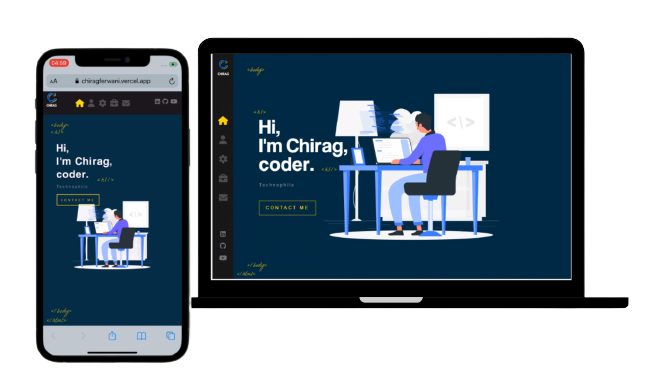

<h1>Personal Portfolio Website </h1>

<h2>
  <a href="https://chiragferwani.vercel.app/">chiragferwani.vercel.app</a>
</h2>

  

  

⭐ Star this repo on GitHub — it helps!

## Features 📋

⚡️ Valid REACT & SCSS \
⚡️ Custom 3D CSS animations\
⚡️ Aimated Letters on hover\
⚡️ Interactive map view\
⚡️ Functional Contact Form
  

## Sections 📚

✔️ Home\
✔️ About\
✔️ Skills \
✔️ Works\
✔️ Contact Me

To view a live example, **[click here](https://chiragferwani.vercel.app/)**

## Tools Used 🛠️

- [**Vercel**](https://vercel.com/new) - To host my  website (HTML, SCSS, JS, REACT).
- [**Font Awesome**](https://fontawesome.com/) - A font and icon toolkit based on CSS.
- [**Leafletjs**](https://leafletjs.com/) - JavaScript Library
- [**React Loader**](https://www.npmjs.com/package/react-loader) - To add page loading animation.
- [**Animate CSS**](https://animate.style/) - To add animations.

 

